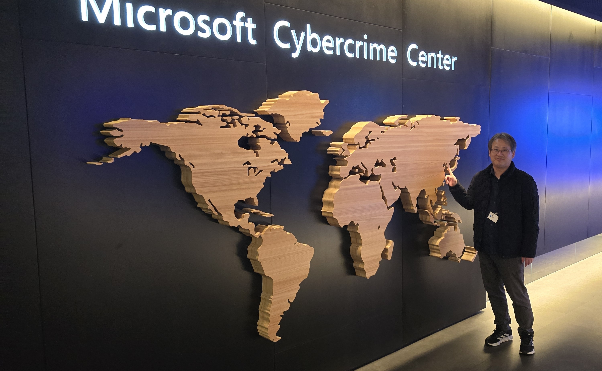

# Microsoft 365 서비스 전문가

저는 Microsoft 365 기반의 디지털 워크플레이스 전환 프로젝트를 수행해온 컨설턴트이자 PM입니다. 단순한 시스템 구축이 아닌, 고객의 업무 방식 자체를 변화시키는 것을 목표로 프로젝트를 이끌어왔습니다. 항상 “이 결정이 고객 조직에 어떤 변화를 가져오는가”를 먼저 고민하며 실행해왔습니다.
M365 프로젝트는 IT 부서뿐 아니라 인사, 보안, 경영진 등 다양한 이해관계자가 참여합니다. 저는 각 부서의 요구사항을 조율하고, 기술 언어를 비즈니스 언어로 번역하는 가교 역할을 수행해왔습니다.

- 새로운 기술을 두려워하기 보다 알아가는 즐거움.

    

- 끊임없는 학습과 경험이 나의 자산이라고 믿어요.

    

- 열린 마음, 함께 즐거워할 줄 아는 여유, 삶을 즐길 줄 아는 멋!

    